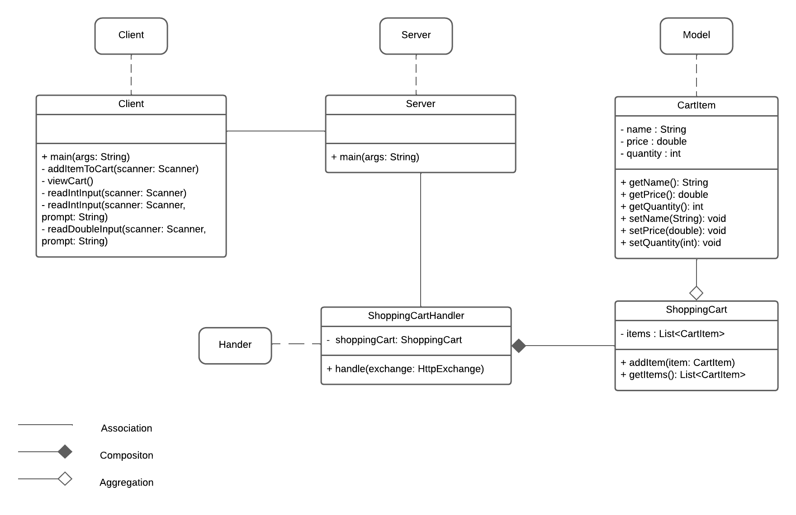
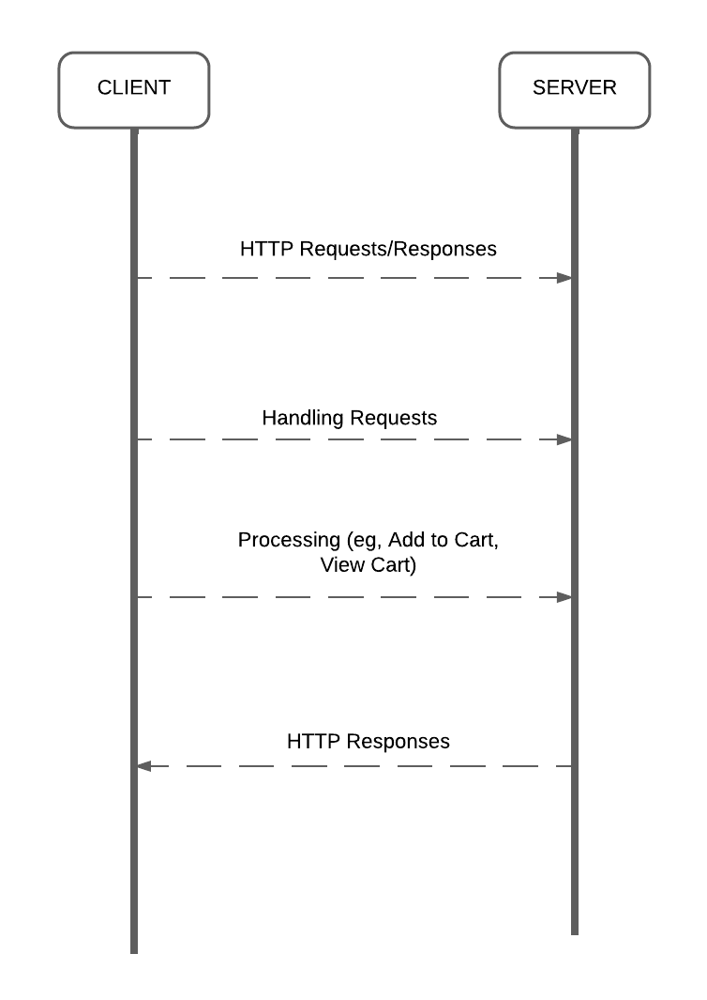

# Shopping Cart Service
(Mili Parikh)

This project implements a simple shopping cart service with a backend API and a client application. The service allows users to add items to the cart and view the cart contents through API calls. It is implemented in Java, utilizing `java.net.http.HttpRequest` for HTTP communication.

## Project Structure

### UML Diagram


### Client-Server Interactions


## Setup

### Prerequisites

- Java Development Kit (JDK) 11 or higher
- A Java IDE or text editor (e.g., IntelliJ IDEA, VS Code)
- A terminal or command prompt

### Installation

1. Clone the repository:

   ```sh
   git clone https://github.com/your-username/shopping-cart-service.git
   cd shopping-cart-service

## Usage

### Running the Server
1. Navigate to the src directory:
    ```
    cd src
    ```
2. Compile the server code:
    ```
    javac server/model/*.java server/handler/*.java server/Server.java
    ```
3. Run the server:
    ```
    java server.Server
    ```
You should see Server started on port 8000 indicating that the server is running.

### Running the Client
1. Open a new terminal or command prompt.
2. Navigate to the src directory:
    ```
    cd src
    ```
3. Compile the client code:
    ```
    javac client/Client.java
    ```
4. Run the client:
    ```
    java client.Client
    ```
5. Follow the prompts to add items to the cart or view the cart contents.

## Example Usage
1. Add an item to the cart:
    - Enter `1` to add an item.
    - Enter the item name, price, and quantity.
    - The client will display `Item added to cart.`
2. View the cart:
    - Enter `2` to view the cart.
    - The client will display the contents of the cart.
3. Exit the client:
    - Enter `3` to exit the client.

## Running Tests

### Prerequisites
- JUnit 5 library

### Running Tests

1. Ensure you are in the test directory of the project.
    ```
    cd test
    ```
2. Compile the test classes:
    ```
    javac -cp .:path/to/junit-platform-console-standalone-1.7.1.jar test/*.java
    ```
3. Run the tests:
    ```
    java -jar path/to/junit-platform-console-standalone-1.7.1.jar --class-path . --scan-class-path
    ```
    Replace path/to/junit-platform-console-standalone-1.7.1.jar with the actual path to the JUnit 5 standalone jar file.

### Test Coverage
- `CartItemTest`: Tests for the `CartItem` model.
- `ShoppingCartTest`: Tests for the `ShoppingCart` model.
- `ShoppingCartHandlerTest`: Tests for the `ShoppingCartHandler` class.
- `ClientTest`: Tests for the `Client` class.

